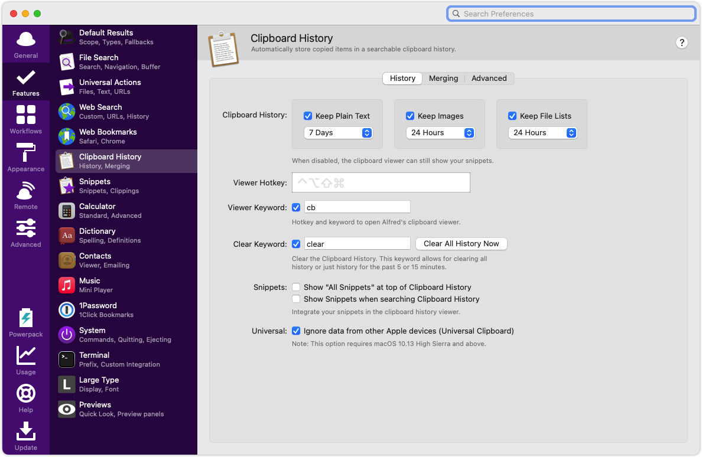
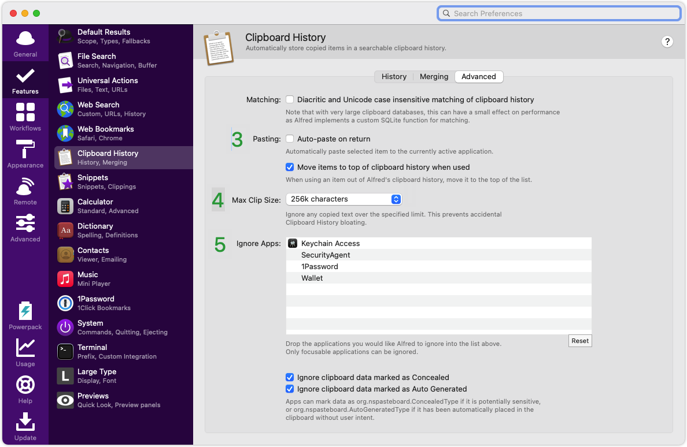

# Alfred 的 clipboard

## clipboard 的功能

clipboard，顾名思义即为剪贴板；对于常常在~~屎山~~代码中徜徉的我们来说，把一坨或多坨~~屎~~代码从这移到那的情况时有发生（虽然移完依然改变不了它的本质），而通过 Alfred 的 clipboard，我们可以查看我们一段时间内复制过的内容，并把它重新粘贴出来，这样我们就可以非常方便地完成~~代码搬运~~写代码的任务。

## 命令配置

在 Alfred 的偏好设置页面中的 Clipboard History 中，我们可以看到默认功能是关闭的，要打开我们需要把 `Keep Plain Text`、`Keep Images`、`Keep Files List` 打开（或者只打开你需要的功能，比如你只想在复制文本的时候存入 Alfred 的剪切板，则只打开第一个），同时也可以设置剪切板记录的自动清除时间。这里笔者使用的是默认配置：

同时，我们可以配置 Clipboard 的查看命令和清除命令：

- `cb`：查看剪切板记录
- `clear`：清除剪切板记录

这时我们激活 Alfred 后使用 `cb` 会出现 “show the clipboard / snippets viewer”，再按下回车即可查看当前的剪切板记录。

当然，我们也可以配置快捷键，不过它有可能和我们其他的软件冲突，这里不推荐大家配置这个快捷键。

如下图前四个部分配置：

## 剪切板操作

- 增：通过系统的复制组合键 `command` + `c` 即可向 Alfred 的 Clipboard 添加一条记录；
- 删：通过上面提到的配置命令 `clear` 即可清空，可以选择清空五分钟内、十五分钟内或全部记录；也可以在上图的配置页面中的 “Clear All History Now” 清空所有；
- 改：
- 查：通过上面提到的自己配置的命令如 `cb` 或自定义的快捷键查看；

## 其他配置

1. 显示 snippets：如无需求，建议关闭，感觉挺影响操作的；
2. 存储其他设备复制的内容：如无需求，建议关闭，不然我们在手机、平板上面复制的内容也会保存在 Clipboard 中；
3. 直接粘贴到当前聚焦位置：如无需求，建议关闭；
4. 设置剪切板单条记录大小限制：如无需求，建议默认设置即可；
5. 忽略剪切板操作的应用（即不存储该应用上复制的内容）：如果一些应用上的内容涉及敏感信息，建议添加到这里；

还有其他的一些细节配置如 “Move items to top of clipboard history when used” 这些大家可以自己根据自己的需求摸索配置，这里就不展开说了。

总而言之，对于 Clipboard 功能有利于我们去管理剪切板的内容，使得我们的 复制 / 粘贴 不再是一个单项操作，而是一个模块式的功能，可以增删改查，可以配置个性化设置等，这也是 Alfred 的特色功能之一。