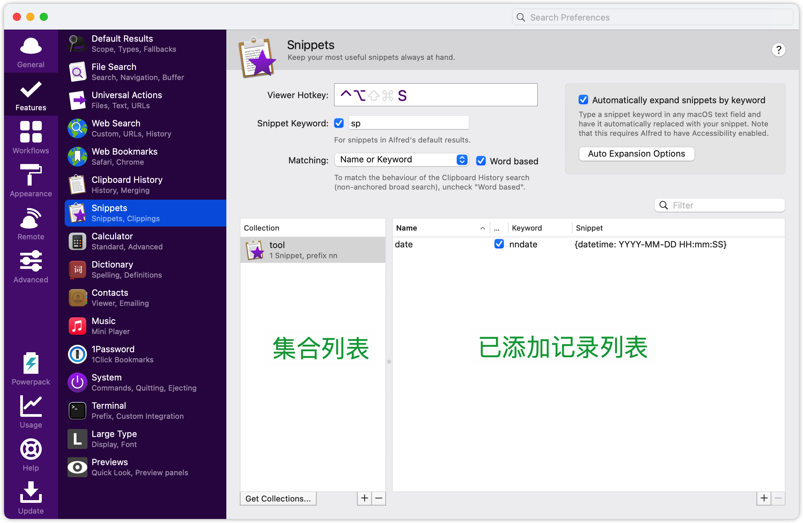

# Alfred 的 Snippets

在前面的训练中，我们学习了 VScode 的 Snippets；而 Alfred 的 Snippets 也是一样的效果：通过键入简短的命令而快速生成一段预设的文本内容；比如笔者写博客的时候常常需要输入固定的时间格式的当前时间文本片段，就可以通过 Snippets 达到快速输入当前时间的效果（当然 Snippets 的功能远不止如此，这里是举个简单例子）。

## 基础配置

打开 Alfred 的设置页面的 Snippets 栏，我们可以先配置 Snippets 的快捷键（笔者设置的为 `ctrl` + `option` + `s`，配置后再任何时候按下快捷键即可调出 Alfred 并进入 Snippets 搜索状态，可以快速搜索已添加的 Snippet 记录）以及 Snippets 的搜索前缀（笔者设置为 `sp`，激活 Alfred 键入该前缀也可以快速搜索已添加的 Snippets 记录）。

界面下方分为左右两块区域：

1. 集合列表，每个集合中可以添加多条 Snippet；
2. Snippet 列表，即已添加的记录列表；

## 创建

在集合列表和 Snippet 列表的右下角都有一个加号，点击即可添加对应的合集或在对应合集中添加一条新的 Snippet 记录；
已前面提到的固定的时间格式的当前时间文本片段，先创建一个集合 tool：

其中：

- Name：即为该集合的名称，在查找的时候可用作关键词；
- Affix：前缀，后续的查找的时候可用作关键词；
- suffix：后缀，用于集合自动展开

点击右下的 save 即可创建一个新的集合；创建后选中新建的集合，点击右边的 Snippet 记录右下方的加号，添加一条新记录：

- Name：名称，在查找的时候可用作关键词；
- Keyword：关键字，后续的查找的时候可用作关键词；
- Type：类型，又分为：
  + Plain Text Snippet（纯文本片段） - Match destination formatting on paste （匹配粘贴时的目标格式）；
  + Rich Text Snippet（富文本片段） - Retain formatting on paste where possible （尽可能保留粘贴时的格式）；
- Snippet：文本片段内容；

:::tip 关键字
在本文的第一张图可以看到，此时右边的 Snippet “date” 的 keyword 显示的是 `nndate`，而在第三张图中，我设置的 keyword 明明是 `date`；关键就在于第二张图中我给 tool 集合设置的前缀 `nn`，该前缀会和单条 Snippet 中设置的 keyword 值合并为一个；

这是因为在我们打开了图一中的 `Automatically expand snippets by keyword` 选项后，我们在任何地方键入已添加的 Snippet 的关键字时，会替换成对应的文本片段，比如我的 Snippet “date” 的关键字是 `date`，那我在输入 date 是则会变成 `YYYY-MM-DD HH:mm:SS` 格式的当前时间文本值；但问题是我们在日常使用中 “date” 这个单词也是很常用的，所以为了区分开触发 Snippet 的情况与正常使用的情况，我们为集合加上了一个前缀，这样其内部的 Snippet 触发时的规则就比较特异而又有规律了，比如我的 Snippet “date” 则会在我键入 `nndate` 时触发。
:::

## 使用

正如上面提到的，我们添加了 Snippet 后可以通过：

- 键入关键字的方式触发，如笔者的 `nndate`；
- 通过图一设置的 viewer hotkey 的组合键激活 Snippet 搜索，再键入已添加的集合或 Snippet 名称或关键字搜索，如笔者的 `ctrl` + `option` + `s` 激活搜索，再键入 `tool` 然后选择 Snippet， 或键入 `date` 或 `nndate` 直接搜索对应 Snippet，选中后通过 `command` + `v` 即可粘贴该 Snippet 内容到对应位置；
- 激活 Alfred 后键入自己设置的图一中的 Snippet keyword 加空格加已添加的 Snippet 名称或关键字搜索，如笔者的 `sp` + ` date` 或 + ` nndate`，选中后通过 `command` + `v` 即可粘贴该 Snippet 内容到对应位置；

:::tip 自动填充到光标所在位置
由于在[昨天的训练](./day-48.md#其他配置)中把 Clipboard 的 `Auto-paste on return` 设置关闭了，所以在上面提到的使用方法的第二、三点中选中 Snippet 后需要通过粘贴把对应文本输出，如果开启了 `Auto-paste on return` 则选中了 Snippet 后就会自动填充到光标所在位置，不过我们使用的时候更多是通过使用方法中的第一种方式，所以这个设置保持关闭就好，以免影响 Clipboard 的使用。
:::

## placeholder

在本文第三张图中，可以看到右下方有个 `{}`，点击它即可查看 Snippet 中可以使用的一些占位符，比如笔者的 “date” 中使用的 `{datetime}` 即为时间占位符，可以输出当前时间；其他的占位符大家可以自行了解，这里只讲有点特殊的两个：

- Clipboard and History：通过该占位符可以插入 Alfred 剪切板中的记录，如 `{clipboard}` 会把剪切板的最新一条的记录内容插入到当前 Snippet 中；也可以通过添加数字指定要插入的对应顺序的剪切板记录，如 `{clipboard:1}` 则为插入第二条（从 0 开始）；
- Cursor：光标位置，和 [VScode Snippet](../vscode/day-25.md#配置自己的-snippet) 的光标位置设置，通过这个占位符可以定义输出 Snippet 文本片段后光标的位置，不过也是要打开 Clipboard 的 `Auto-paste on return` 设置。

## 自动展开

## 分享